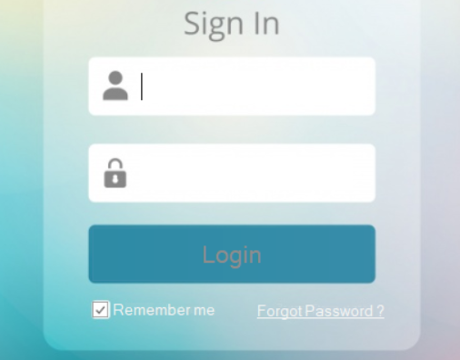

# Ecran d'accueil

L'écran de log-in suivant s'affiche au lancement de l'application:

Pour se connecter à l'application l'utilisateur doit entrer :
- son nom d'utilisateur
- son mot de passe

Remarques: 
- l'utilisateur peut cocher l'option remember me pour que son nom d'utilisateur soit enrengistrer lors d'une prochaine connexion.
- l'utilisateur peut récupérer son mot de passe en cas d'oubli via le lien cliquable forgot password
