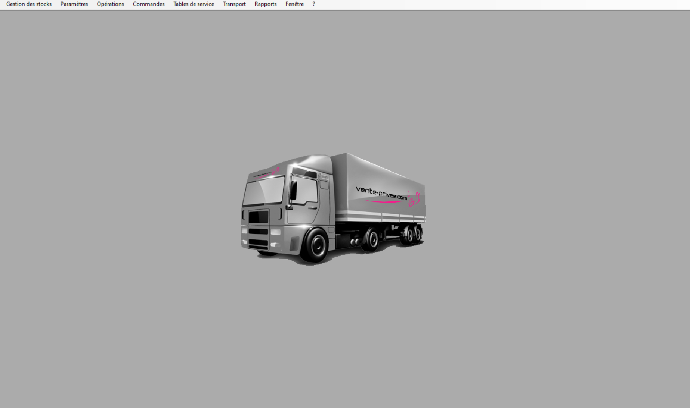

# Menu principale

Après avoir entré ses données d'identification , l'utilisateur voit l'écran suivant apparaitre:

Les menus déroulant suivants apparaissent:
- Gestion des stocks: permets d'effectuer des actions en lien avec la gestion des stocks
- Paramètres: permets de modifier les paramètres de l'application, nottament la couleur des menus
- Opérations: permets de préparer une nouvel opération (vente)
- Commandes: permets de voir les commandes préparer
- Tables de service: permets de consulter les frais de transport
- Transport: permets de voir la liste des transporteurs
- Rapports: permets de générer des rapports et de les exporter en fichier Excel
- Fenêtre: permets d'afficher les fenêtres ouverte
- ?: permets d'afficher le guide utilisateur
