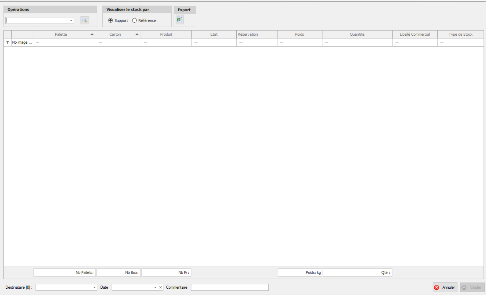

# Gestion des stocks
En cliquant sur le menu gestion des stocks, le menu déroulant s'affiche:

En cliquant sur le menu déroulant gestion des stocks et ensuite sur créer un OT intersite , l'utilisateur peut créer un OT intersite.
Il doit renseigner notamment, le nom de l'opération(vente) , le destinataire , la date ainsi qu'un commentaire (optionnel)