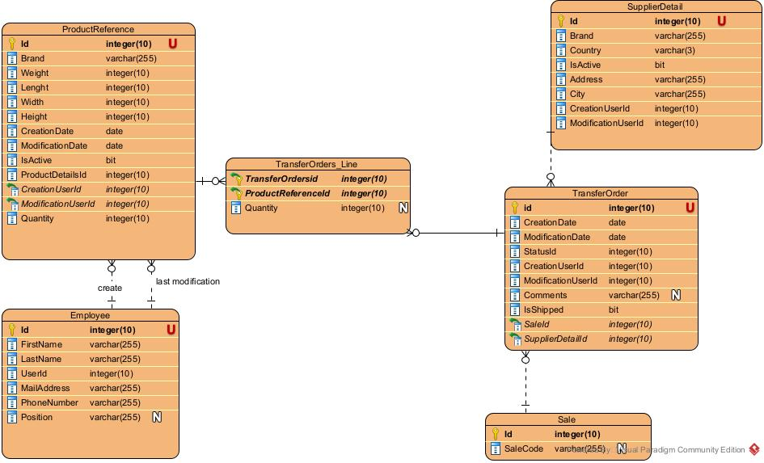

# Database
Voici un schéma qui décrit le modèle de base de données utiliser par l'application

La table **Product** contient toutes les informations relative aux produits.

La table **Employee** contient toutes les informations relative aux employées.

La table **TransferOrder** contient toutes les informations relative aux OT.

La table **SupplierDetail** contient toutes les informations relative aux fournisseurs.

La table **Brand** contient le nom des marques.

En ce qui concerne les relations entre les différents tables , nous avons:
- une relation 1---n entre la table Employee et la table Product car un employé peut avoir scanner plusieurs produits
- une relation 1---n entre la table Employee et la table SupplierDetail car un employé peut avoir ajouter les détails de plusieurs fournisseurs différents
- une relation 1---n entre la table Employee et la table TransferOrder car un employé peut avoir créer plusieurs OT
- une relation n---1 entre la table TransferOrder et la table Brand car une marque peut être présente sur plusieurs OT
- une relation n---1 entre la table TransferOrder et la table SupplierDetail car un fournisseur peut être présent sur plusieurs OT
- et pour finir une relation 1-1 entre la table Brand et la table SupplierDetail car une marque ne peut avoir q'un seul fournisseur correspondant
