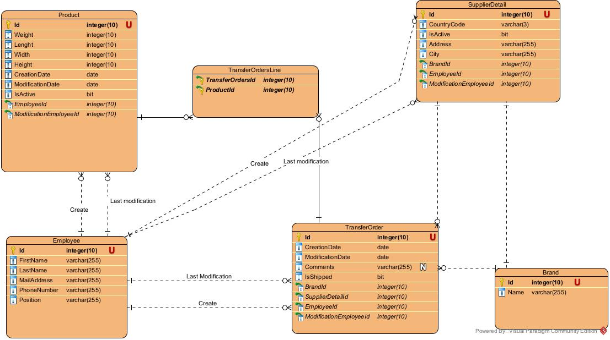

# Database
Voici un schéma qui décrit le modèle de base de données utiliser par l'application

La table **ProductReference** contient toutes les informations relative aux produits.

La table **Employee** contient toutes les informations relative aux employées.

La table **TransferOrder** contient toutes les informations relative aux OT.

La table **SupplierDetail** contient toutes les informations relative aux fournisseurs.

La table **Sale** contient le code opération d'une vente.
