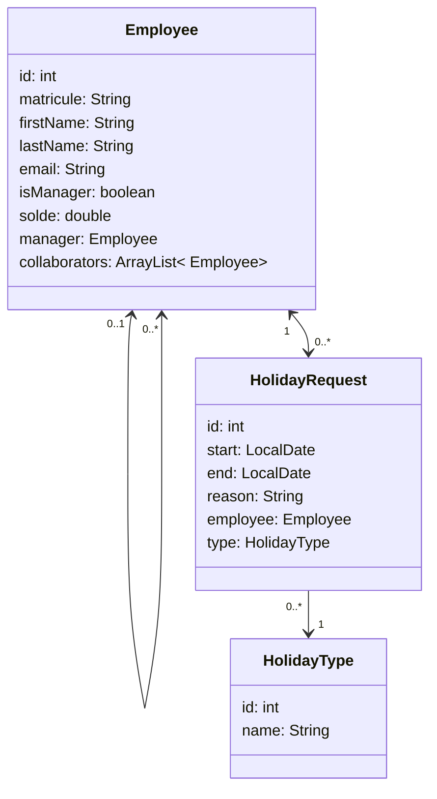

# Architecture
Warehouse-stock-app est une application desktop écrite en java avec une base de données MySql.

Les entités de la demande de congés sont:

```mermaid
classDiagram
    Employee "0..1" <--> "0..*" Employee
    Employee "1" <--> "0..*" HolidayRequest
    HolidayRequest "0..*" --> "1" HolidayType

    class Employee {
        id: int
        matricule: String
        firstName: String
        lastName: String
        email: String
        isManager: boolean
        solde: double
        manager: Employee
        collaborators: ArrayList< Employee>
    }

    class HolidayRequest {
        id: int
        start: LocalDate
        end: LocalDate
        reason: String
        employee: Employee
        type: HolidayType
    }

    class HolidayType {
        id: int
        name: String
    }
```
- dfgg